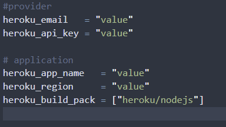
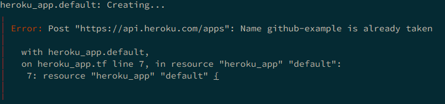
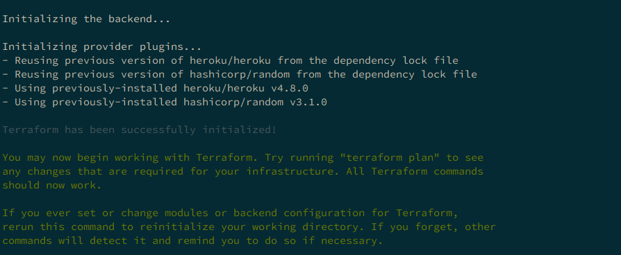
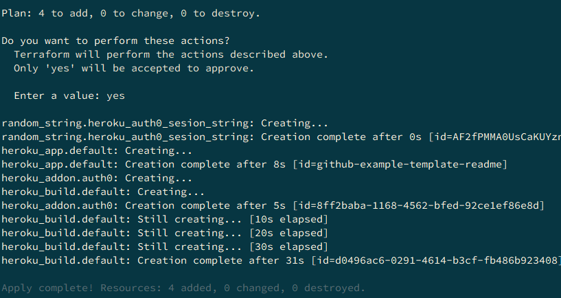
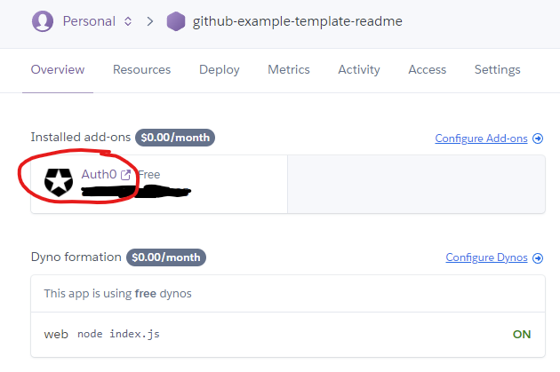
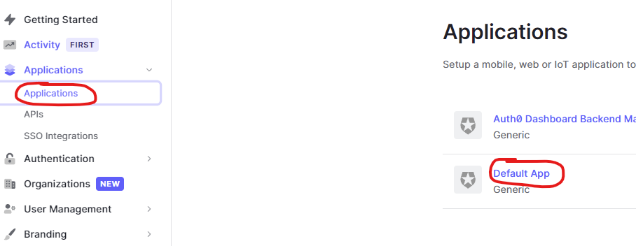
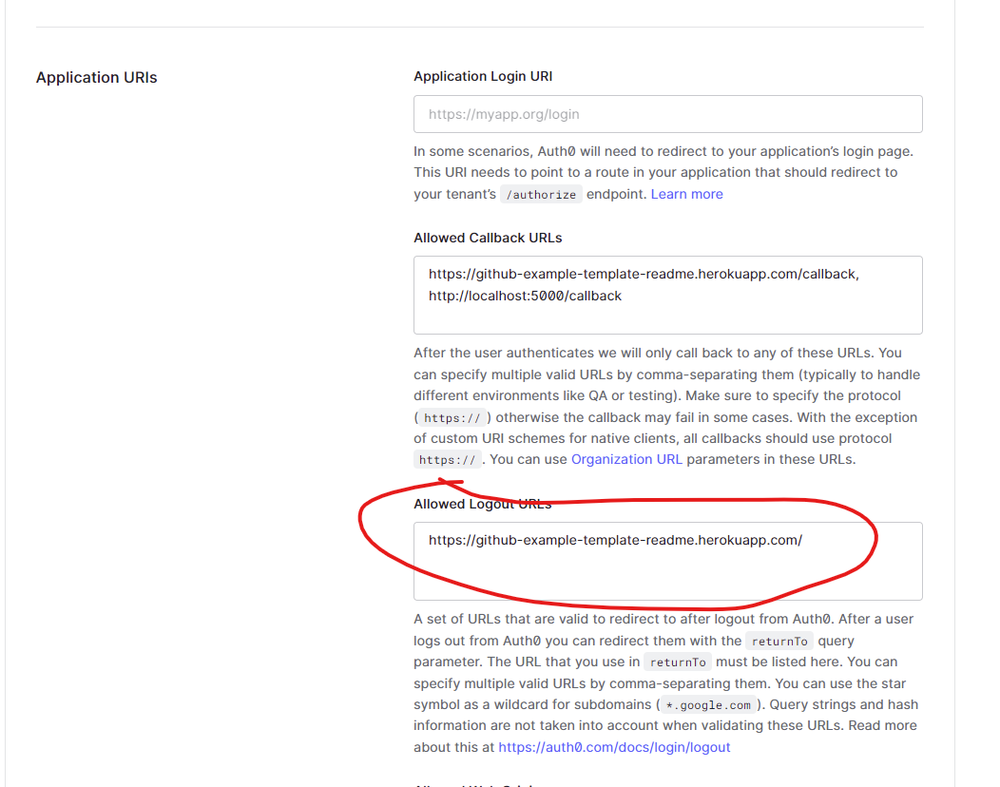

# heroku-auth0-template

This is a template for a Terraform configuration that deploys a basic expressJS web-app with auth0 authentication onto heroku.  
The web-app is taken from the official auth0 blog post: https://auth0.com/blog/create-a-simple-and-secure-node-express-app/  
_source code_: https://github.com/auth0-blog/wab-portal-express

## Requirements

Heroku account created  
Payment method added to the heroku account

## Important

Terraform is **NOT** configured with a remote backend so your state file will be local to the machine where you are running the commands.

## How to use

Create your tfvars file using the provided `./terraform/vars.tfvars` file.

_**note**: your heroku_app_name must be unique. If someone has already used it, you'll get the following error:_

From the `terraform` directory, initialise Terraform `terraform init`.

From the `terraform` directory run `terraform apply -var-file=vars.tfvars`

Once deployed, use the heroku console to sso into the auth0 console for your addon config:

navigate to the default application config

add the heroku app domain to the allowed logout urls:

Go to your heroku-url and click the login button to start the auth0 process.

## Cleanup

Run `terraform destroy -var-file=vars.tfvars` to remove the resources.
